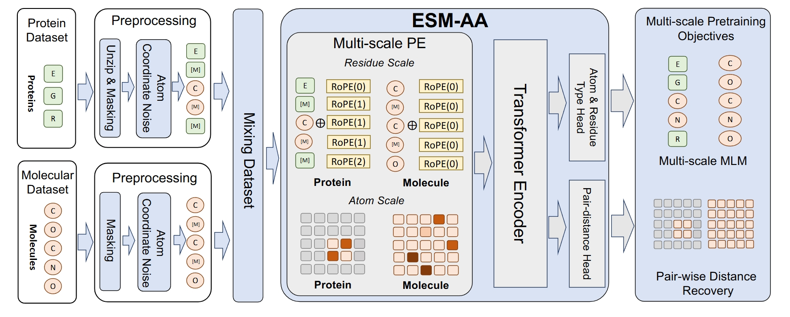
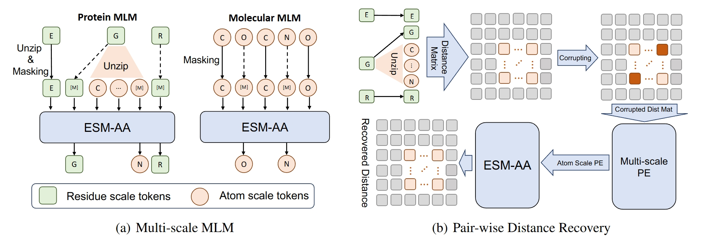

# 基于Paddle框架的ESM-AA蛋白质接触图预测复现


## 1 背景介绍

蛋白质语言模型（Protein Language Model, PLM）利用大量无标注序列进行训练，在结构预测、功能注释与分子设计等任务中表现卓越。传统PLM仅在氨基酸残基尺度建模，然而，在涉及蛋白质-小分子相互作用等任务时，仅靠残基级信息无法捕捉原子间精细结构信息，限制了其在与小分子相互作用、口袋配体筛选等场景中的应用。为了适配这类任务，研究者常需组合蛋白语言模型与独立的小分子模型，不能统一处理蛋白与小分子信息。但是，能够统一处理蛋白信息和小分子信息的模型往往会遇到跨尺度信息（残基与原子）的建模困难的问题，包括不同尺度的词汇不兼容性、需要复杂的位置编码以对齐残基与原子以及完全原子级建模在大蛋白上代价高昂。

因此，论文《ESM All-Atom: Multi-scale Protein Language Model for Unified Molecular Modeling》旨在构建一个可统一表示蛋白和小分子的语言模型，既能保留蛋白语言模型的表达能力，又能引入分子级精度。为了同时处理残基与原子两种尺度的输入，论文借鉴了机器翻译研究中处理多语言任务的code-switching方法，针对传统ESM模型进行了改进，提出了ESM-AA模型，通过构造残基-原子混合的code-switching序列，并构造残基尺度和原子尺度的位置编码，实现了PLM的能力提升。


## 2 论文方法

ESM-AA 的关键目标是在统一的 Transformer 模型的预训练过程中同时学习蛋白质的残基语义信息与原子级几何信息。为此，作者设计了两个关键模块，首先是多尺度残基-原子序列构建模块，该模块借鉴 Code-Switch结构，在序列级 token中插入部分原子级 token，构建混合粒度输入；然后是多尺度位置编码模块，该模块为残基级与原子级 token设计不同类型的位置编码，并在注意力中融合距离偏置，增强结构感知。整体框架如下图所示：



**多尺度残基-原子序列构建模块**

传统蛋白质语言模型（如 ESM）仅对残基级别进行建模，输入是一串氨基酸序列，这忽略了每个残基由多个原子组成的事实。为引入原子粒度表示，ESM-AA 借鉴了多语言机器翻译任务中的Code-Switch策略，即在一段话中使用了多种语言的词汇和表达，来构建残基-原子混合序列，具体步骤如下：首先进行随机抽样，在一个残基组成的序列 $𝑋 = (r_1, r_2, ..., r_L)$ 中，随机选择约 1%的残基进行 UNZIP 操作，将该残基展开为对应的原子序列 $A_i = (a^i_1, ..., a^i_{N_i})$ ，然后对于被展开的残基，同时保留该残基 token，并将其包含的所有原子按主链+侧链的顺序插入序列，这个过程需要保持位置同步，即原子 token 在序列中插入的位置紧随其残基 token，以保持语义对应；最后需要进行类型标识，即所有原子 token 会附加特定 type 后缀方便后续的编码与区分，得到最终的 Code-Switching 序列：


$$
\bar{X} = (r_1, ..., r_{i-1}, r_i, a^i_1, ..., a^i_{N_i}, r_{i+1}, ..., r_L)
$$


同时提供原子的三维坐标信息，可以更好地开展后续的结构建模等预训练任务。通过多尺度残基-原子序列构建模块，可以实现蛋白质结构与结构语义的对齐，实现原子几何与残基语义的联合建模，且遵循了最小破坏原始序列，只有少量残基被展开，大多数仍是常规 token，利于预训练稳定；且能够使模型获得更强迁移能力，使模型兼容原子级任务（如结合位点预测）与残基级任务（如接触图预测）。

**多尺度位置编码模块**

传统的 Transformer 使用固定或相对位置编码（如 RoPE）来处理序列顺序，但无法体现蛋白质中三维结构中的空间关系。ESM-AA 为残基和原子 token 分别设计了不同位置表示策略，并在注意力中融合几何偏置信息。

对于残基级位置编码，模型会对所有残基 token，包括未被 UNZIP 的、以及作为父节点的残基 token 使用 RoPE 编码，从而保证模型捕捉序列中的相对顺序信息。此外，如果一个残基被展开，其所有原子 token 会在序列层面共享该残基 token 的 RoPE 编码。

对于原子级位置编码，模型则采用注意力层偏置的方式，将包含了原子相对结构信息的位置编码作为位置嵌入直接注入模型。具体来说，针对任意两个原子 token $i,j$ ，如果二者均为原子，或一个是原子一个是残基且有坐标定义，则通过欧氏距离计算空间关系：


$$
d_{ij} = \| x_i - x_j \|_2
$$


其中 $x_i$ 和 $x_j$ 代表两个原子的坐标，然后使用多组高斯基函数将距离映射到偏置空间：


$$
b_{ij}^{\text{geom}} = \sum_{k=1}^{K} w_k \cdot \exp\left(-\frac{(d_{ij} - \mu_k)^2}{2\sigma_k^2}\right)
$$


其中， $\mu_k$ 和 $\sigma_k^2$ 是固定或可学习的高斯中心和带宽，最终得到的 $b^{geom}_{ij}$ 则作为偏置项加入注意力计算过程中，可表示如下：


$$
\text{Attn}(i, j) = \frac{q_i^\top k_j}{\sqrt{d}} + b^{geom}_{ij}
$$


通过上述的多尺度位置编码，可以显式引入几何距离，有效建模近邻原子之间的物理作用，使得残基与原子共享 RoPE 或几何偏置，便于模型学习多尺度一致性，与传统 attention 模块兼容，训练时高效，适配大规模数据。


## 3 训练过程

论文提出的ESM-AA模型主要分为两步：预训练和下游任务微调与测试。由于原论文提供的github仓库中既没有预训练代码，也没有针对下游任务微调的代码，只有模型结构的定义以及针对其中一个下游任务进行测试的checkpoint，因此我们仅复现了预训练过程和该下游任务的微调与测试过程。下面我们针对预训练任务和该下游任务进行介绍：



（1）多尺度掩码语言建模（Multi-Scale MLM）：在输入蛋白质序列中，随机掩盖一部分残基或原子token（如氨基酸类别、原子种类），要求模型在上下文信息下预测被掩盖token的真实类别：


$$
\mathcal{L}_{\mathrm{MLM}} = -\sum_{i \in \mathcal{M}} \log P_{\theta}(x_i \mid x_{\setminus i})
$$


其中 $\mathcal{M}$ 表示被掩码的位置集合， $\theta$ 是模型参数， $x_i$ 是被预测的token。该任务鼓励模型学习到多尺度上下文语义。

（2）原子对距离恢复（Pairwise Distance Recovery, PDR）：对于序列中的残基，其所有原子坐标会添加随机扰动，模型需预测扰动后原子之间的真实对距离：


$$
\mathcal{L}_{\mathrm{PDR}} = \sum_{(i,j) \in \mathcal{A}} \left\| d_{ij}^{\text{pred}} - d_{ij}^{\text{true}} \right\|^2
$$


其中 $\mathcal{A}$ 是残基内部原子对集合， $d_{ij}^{\text{true}}$ 是原始结构中的真实距离， $d_{ij}^{\text{pred}}$ 是模型输出的预测值。该任务促使模型理解三维几何关系。

**下游任务定义：蛋白质接触图预测**

该任务旨在判断蛋白质序列中任意两个残基是否处于空间接触状态，定义为两者的 $c_{\beta}$ 间距是否小于阈值（通常为8Å）。模型需要输出残基对的接触概率 $C_{ij}$ ，优化目标是交叉熵损失：


$$
\mathcal{L}_{\mathrm{CE}}=-\sum_{i<j}\left[C_{ij}\log\hat{C}_{ij}+(1-C_{ij})\log(1-\hat{C}_{ij})\right]
$$


其中 $C_{ij} \in \{0,1\}$ 表示真实接触标签（1表示接触，0表示不接触）， $\hat{C}_{ij}$ 为模型预测概率，通常由残基对向量经过多层感知机MLP生成。接触图评估指标如下：


$$
\text{Precision@L/k} = \frac{\text{正确预测接触数（排名前 L/k）}}{L/k}
$$


采用精确率（Precision）在前Top-L、Top-L/2和Top-L/5个预测中计算，反映模型对长距离接触的识别能力。


## 4. 数据集介绍

对于预训练任务，原文使用了AlphaFold DB数据集和Uni-Mol使用的数据集。但是这两个数据集加起来达到了TB量级，在有限的资源限制下很难全部投入训练。因此，我们仅使用了AlphaFold DB数据集中的Swiss-Prot数据集，包含了残基数据和原子数据，共26GB数据，用于预训练。

对于蛋白质接触图预测下游任务，原文使用了ProteinNet中的CASP12数据集，我们则选取了稍小一些的CASP7数据集，共3GB数据，从中提取残基序列，以及坐标数据构建接触图，将其用于微调。


## 5. 准备工作

创建环境：

```
conda create -n ESMAA python=3.10
```

安装依赖包：

```
pip install -r requirements.txt
```

数据集下载：

swissprot数据集：https://ftp.ebi.ac.uk/pub/databases/alphafold/latest/swissprot_pdb_v4.tar

casp7数据集：https://sharehost.hms.harvard.edu/sysbio/alquraishi/proteinnet/human_readable/casp7.tar.gz

本项目的文件目录树如下：


```
code
├─ 📁data
│  ├─ 📁casp7
│  ├─ 📁eval
│  └─ 📁swissprot
├─ 📁model
│  ├─ 📄axial_attention.py
│  ├─ 📄model.py
│  ├─ 📄modules.py
│  ├─ 📄multihead_attention.py
│  ├─ 📄rotary_embedding.py
│  └─ 📄tokenizer.py
├─ 📄evaluate.py
├─ 📄finetune.py
├─ 📄train.py
├─ 📄requirements.py
└─ 📄README.md
```


## 6. 运行代码


运行以下命令开始预训练和微调

```
CUDA_VISIBLE_DEVICES=0,1,2,3 python -m paddle.distributed.launch train.py
CUDA_VISIBLE_DEVICES=0,1,2,3 python -m paddle.distributed.launch finetune.py
```

运行以下命令开始评测

```
CUDA_VISIBLE_DEVICES=0 python evaluate.py
```


## 7. 训练结果

代码会自动保存预训练和微调的日志，放在`log`文件夹下：

预训练日志：


```
Pretraining:   0%|  | 0/300000 [00:02<?, ?it/s, Total=24.7835, MLM=4.9098, PDR=0.5144, Step=0]
Pretraining:   0%|  | 1/300000 [00:02<189:59:29,  2.28s/it, Total=24.7835, MLM=4.9098, PDR=0.5144, Step=0]
Pretraining:   0%|  | 1/300000 [00:02<189:59:29,  2.28s/it, Total=29.1593, MLM=4.2864, PDR=1.2014, Step=1]
Pretraining:   0%|  | 2/300000 [00:02<110:58:34,  1.33s/it, Total=29.1593, MLM=4.2864, PDR=1.2014, Step=1]
Pretraining:   0%|  | 2/300000 [00:03<110:58:34,  1.33s/it, Total=28.3053, MLM=4.1512, PDR=1.1701, Step=2]
Pretraining:   0%|  | 3/300000 [00:03<90:12:20,  1.08s/it, Total=28.3053, MLM=4.1512, PDR=1.1701, Step=2]
Pretraining:   0%|  | 3/300000 [00:05<90:12:20,  1.08s/it, Total=28.6190, MLM=4.1616, PDR=1.1973, Step=3]
Pretraining:   0%|  | 4/300000 [00:05<96:35:36,  1.16s/it, Total=28.6190, MLM=4.1616, PDR=1.1973, Step=3]
Pretraining:   0%|  | 4/300000 [00:05<96:35:36,  1.16s/it, Total=28.1309, MLM=4.1828, PDR=1.1400, Step=4]
Pretraining:   0%|  | 5/300000 [00:05<88:48:33,  1.07s/it, Total=28.1309, MLM=4.1828, PDR=1.1400, Step=4]
Pretraining:   0%|  | 5/300000 [00:06<88:48:33,  1.07s/it, Total=27.4046, MLM=4.1242, PDR=1.0908, Step=5]
Pretraining:   0%|  | 6/300000 [00:06<84:29:46,  1.01s/it, Total=27.4046, MLM=4.1242, PDR=1.0908, Step=5]
Pretraining:   0%|  | 6/300000 [00:07<84:29:46,  1.01s/it, Total=28.4380, MLM=4.1151, PDR=1.1977, Step=6]
Pretraining:   0%|  | 7/300000 [00:07<68:17:07,  1.22it/s, Total=28.4380, MLM=4.1151, PDR=1.1977, Step=6]
Pretraining:   0%|  | 7/300000 [00:08<68:17:07,  1.22it/s, Total=30.2772, MLM=4.4476, PDR=1.2487, Step=7]
......
```

微调日志：

```
Training:   0%|          | 0/25285 [00:00<?, ?step/s, epoch=1, loss=0.9740]
Training:   0%|          | 1/25285 [00:00<4:48:25,  1.46step/s, epoch=1, loss=0.9740]
Training:   0%|          | 1/25285 [00:01<4:48:25,  1.46step/s, epoch=1, loss=0.9648]
Training:   0%|          | 2/25285 [00:01<3:20:34,  2.10step/s, epoch=1, loss=0.9648]
Training:   0%|          | 2/25285 [00:01<3:20:34,  2.10step/s, epoch=1, loss=0.9737]
Training:   0%|          | 3/25285 [00:01<3:20:34,  2.10step/s, epoch=1, loss=0.9701]
Training:   0%|          | 4/25285 [00:01<1:39:25,  4.24step/s, epoch=1, loss=0.9701]
Training:   0%|          | 4/25285 [00:01<1:39:25,  4.24step/s, epoch=1, loss=0.9740]
Training:   0%|          | 5/25285 [00:01<1:34:40,  4.45step/s, epoch=1, loss=0.9740]
Training:   0%|          | 5/25285 [00:01<1:34:40,  4.45step/s, epoch=1, loss=0.9730]
Training:   0%|          | 6/25285 [00:01<1:34:40,  4.45step/s, epoch=1, loss=0.9732]
Training:   0%|          | 7/25285 [00:01<1:06:50,  6.30step/s, epoch=1, loss=0.9732]
Training:   0%|          | 7/25285 [00:01<1:06:50,  6.30step/s, epoch=1, loss=0.9740]
Training:   0%|          | 8/25285 [00:01<1:06:50,  6.30step/s, epoch=1, loss=0.9707]
Training:   0%|          | 9/25285 [00:01<56:52,  7.41step/s, epoch=1, loss=0.9707]  
Training:   0%|          | 9/25285 [00:01<56:52,  7.41step/s, epoch=1, loss=0.9738]
......
```

